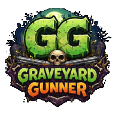

  

# Graveyard Gunner

Unreal Engine 5.6 project made during CG Spectrum [Game Programming Foundations](https://www.cgspectrum.com/courses/game-programming-foundations) course

See [this link for a video](https://www.youtube.com/watch?v=Qgi4miDoF0s) of the game in action!

## Features

- Weapon system
- Material system
- Dismemberment
- Blood and gore FX
- AI-controlled enemies
- Camera shake
- Audio
- UI
- Save system

## Assets Used

- [Necropolis - Graveyard Kit](https://www.fab.com/listings/b3d214c2-50fa-4a0e-a780-bee56c1baf8f)
- [Blood FX](https://www.fab.com/listings/38d114c4-d806-4255-a18c-4cb4054b8af2)
- [Bullet Impact FX](https://www.fab.com/listings/2b44ffdf-64ee-41ed-a82b-9e55b2346d04)
- [Muzzle Flash 3D](https://www.fab.com/listings/5cbcbcfa-8d17-4ed2-b0f1-9f9d96d95ba1)
- [Muzzle Flash VDB](https://www.fab.com/listings/b33a8255-2070-4a7b-9fdc-b7ed2d01d7b5)
- [Portal FX](https://www.fab.com/listings/0062e70e-3133-4c7e-8c13-a8232b87123a)
- [Realistic Starter VFX Pack Vol2](https://www.fab.com/listings/ac2818b3-7d35-4cf5-a1af-cbf8ff5c61c1)
- [Mixamo](https://www.mixamo.com/) animations
- [Mixamo](https://www.mixamo.com/) character and zombie models
- [TurboSquid](https://www.turbosquid.com/) [AK47](https://www.turbosquid.com/FullPreview/1701128) and [M4A1](https://www.turbosquid.com/FullPreview/1708945) models
- [Low Health on screen effect](https://that-skye.itch.io/low-health-on-screen-effect)
- [GTA V Enhanced Weapon Icons V7](https://www.gtagaming.com/gta-v-enhanced-weapon-icons-v7-f32049.html)
- Logos created with [ChatGPT](https://chat.openai.com/)

## References

- [How to add ammo and reload functionality to a weapon in Unreal Engine](https://trueoutlaw.medium.com/how-to-add-ammo-and-reload-functionality-to-a-weapon-in-unreal-engine-503a1e92352a)
- [How to create a weapon system in Unreal Engine](https://trueoutlaw.medium.com/how-to-create-a-weapon-system-in-unreal-engine-5-02159f7d5a0d)